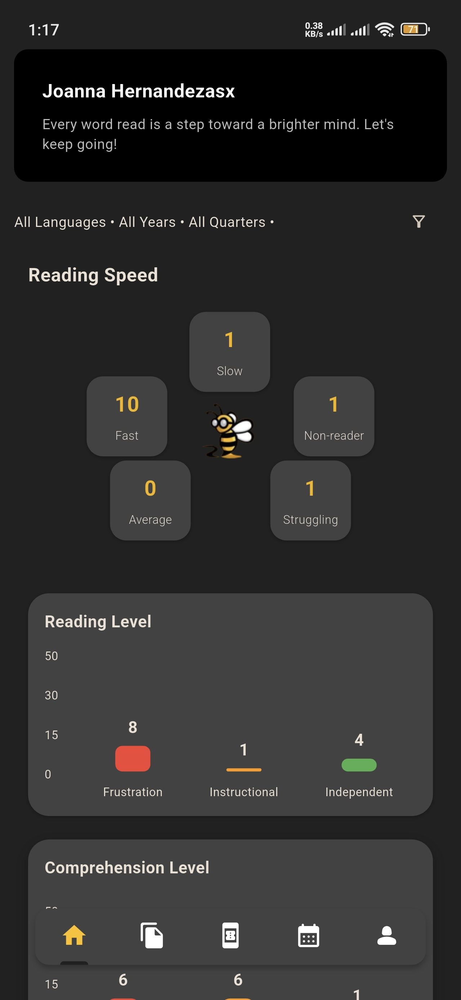
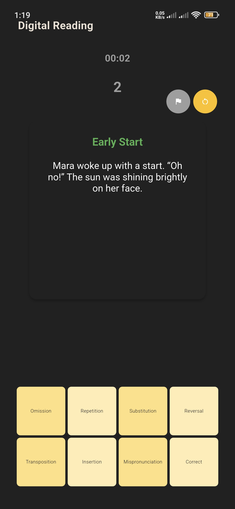
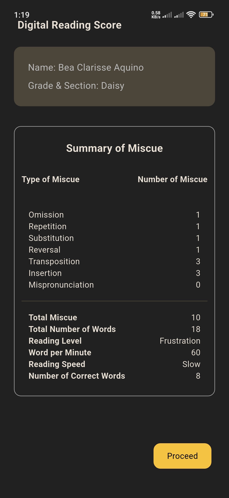
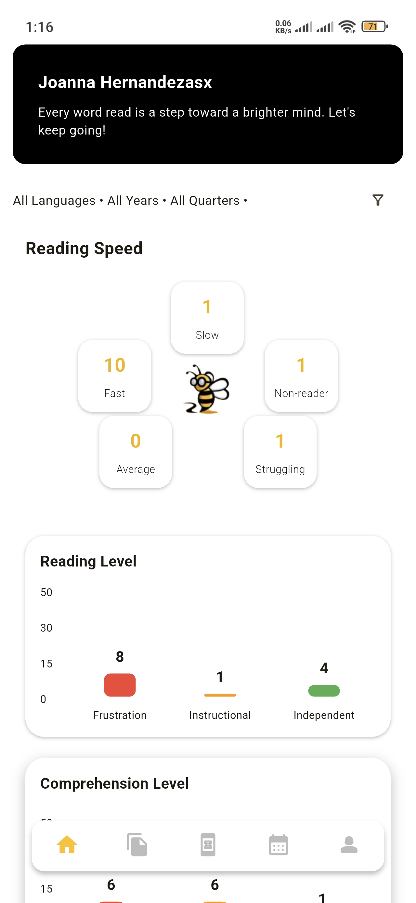
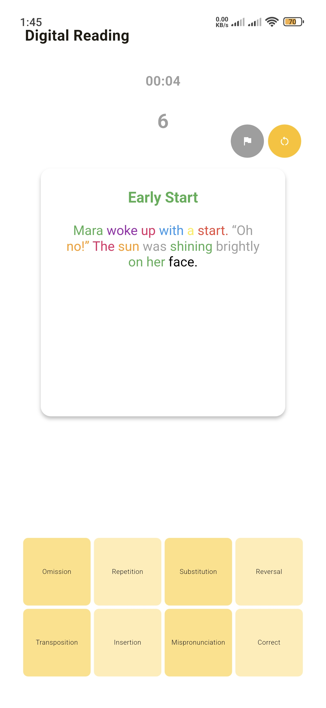
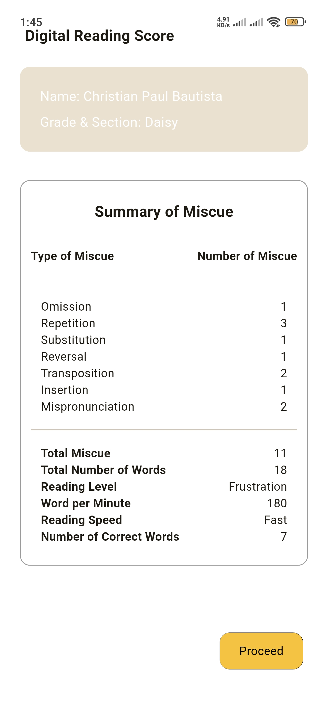

# ReadBee Lite

ReadBee Lite is a Flutter-based reading assessment application designed to help teachers evaluate students' reading performance through digital reading materials, miscue analysis, comprehension assessment, and automated score calculation.

The app aims to eliminate common reading struggles, helping students gain confidence and fluency across multiple languages. With curated reading materials, quizzes, and guided exercises, readbee_lite supports educators in monitoring performance while fostering independent learning.

## Features

### Student Management

* Manage student records
* Organize students by section
* Track reading assessment history

### Reading Assessment

* Digital reading material selection
* Real-time reading evaluation
* Miscue recording and tracking
* Automatic reading accuracy computation

### Comprehension Assessment

* Record comprehension scores
* Calculate final reading performance metrics
* Generate assessment summaries

### Data Management

* Secure user authentication
* Cloud database storage
* Synchronization across devices

---

## Screenshots

# Dark Mode

| Dashboard      | Reading Assessment | Results        |
| -------------- | ------------------ | -------------- |
|  |      |  |


# Light Mode

| Dashboard      | Reading Assessment | Results        |
| -------------- | ------------------ | -------------- |
|  |      |  |

---

## Tech Stack

### Frontend

* Flutter
* Dart

### State Management

* Riverpod

### Backend

* Supabase

### Database

* PostgreSQL (Supabase)

### Authentication

* Supabase Auth

### Storage

* Supabase Storage

### Testing

* Flutter Test
* Mocktail

### CI/CD

* GitHub Actions

---


## Project Structure

The project follows a feature-based architecture using Riverpod for state management or MVVM style architecture.

```text
lib/
├── components/
│   └── Reusable UI components
│
├── models/
│   └── Data models
│
├── viewmodels/
│   └── providers
│   └── notifiers
│
├── core/
│   └── utils
│   └── services
│   └── layouts
│   └── themes
│
├── views/
│   └── Application screens
│
└── main.dart
```

### Data Flow

```text
UI
 ↓
Riverpod Providers
 ↓
Repositories
 ↓
Supabase Services
 ↓
PostgreSQL Database
```

---

## Getting Started

### Prerequisites

Before running the project, make sure you have:

* Flutter SDK
* Dart SDK
* Android Studio or VS Code
* Supabase Account

Check Flutter installation:

```bash
flutter doctor
```

---

## Installation

Clone the repository:

```bash
git clone https://github.com/your-username/readbee_lite.git
```

Navigate to the project:

```bash
cd readbee_lite
```

Install dependencies:

```bash
flutter pub get
```

---

## Environment Configuration

Create a `.env` file in the root directory:

```env
SUPABASE_URL=your_supabase_project_url
SUPABASE_ANON_KEY=your_supabase_anon_key
```

---

## Supabase Setup

### Create a Supabase Project

1. Create a project in Supabase.
2. Obtain:

   * Project URL
   * Anon Key

### Configure Authentication

Enable the authentication providers you plan to use.

Examples:

* Email & Password
* Google Sign-In

### Database

Create the required tables for:

* Users
* Students
* Sections
* Reading Materials
* Evaluations
* Miscues
* Scores

---

## Running the Application

### Development

```bash
flutter run
```

### Release

Android:

```bash
flutter build apk --release
```

App Bundle:

```bash
flutter build appbundle --release
```

iOS:

```bash
flutter build ios --release
```

---

## Testing

Run all tests:

```bash
flutter test
```

Run a specific test:

```bash
flutter test test/path/to/test_file.dart
```

Generate coverage:

```bash
flutter test --coverage
```

### Testing Strategy

#### Unit Tests

* Utility functions
* Business logic
* Score calculations

#### Widget Tests

* Pages
* Components
* User interactions

---

## Continuous Integration

GitHub Actions automatically performs:

* Dependency installation
* Code analysis
* Unit and widget testing
* Build verification

Example workflow:

```text
Push / Pull Request
        ↓
Flutter Analyze
        ↓
Flutter Test
        ↓
Build APK
        ↓
Success
```

---

## Code Quality

Analyze code:

```bash
flutter analyze
```

Format code:

```bash
dart format .
```

Fix common issues:

```bash
dart fix --apply
```

---

## Future Improvements

* PDF report generation
* Analytics dashboard
* Offline-first synchronization
* Teacher performance insights
* Student reading history visualization
* Export assessment results

---

## Author

Developed with Flutter, Riverpod, and Supabase as part of a digital reading assessment platform.
